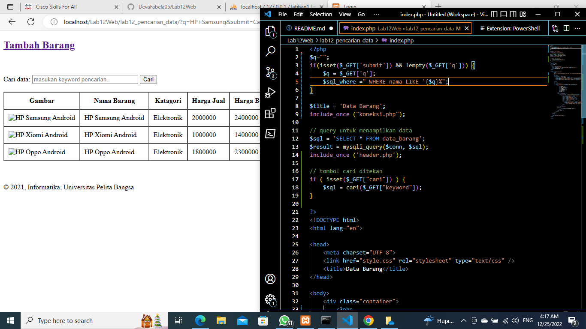

# Lab12Web

## Membuat Pencarian Data

### Langkah - langkah Pratikum 12

#### membuat folder lab12_pencarian_data

Dengan mengaktifkan xampp terlebih dahulu untuk menyalakan aphace dan mysql, membuat database user , lalu kemudian membuat folder baru dengan nama lab12_pencarian_data pada root directory web server (c:\xampp\htdocs). dan bisa di cek melalui http://localhost/lab12_pencarian_data/ pada google chrome maupun mozila. Beginilah tampilannya:

#### Menambahkan function pada file index.php

untuk membuat query pada pencarian data. Inilah tampilannya:

#### Membuat form pencarian
Sisipkan kode tersebut pada file index.php (daftar barang), sebelum table data dan sesudah tombol tambah data. Inilah tampilannya:

#### Hasil Pratikum 12

Inilah tampilanya:
![gambar4](screenshot/hsl.png